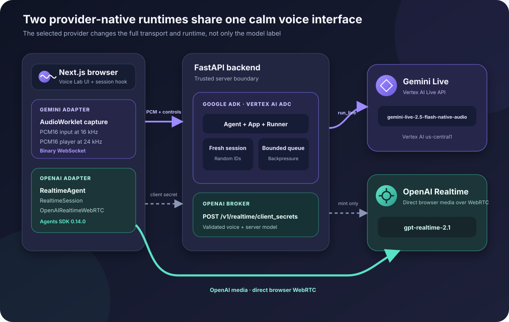
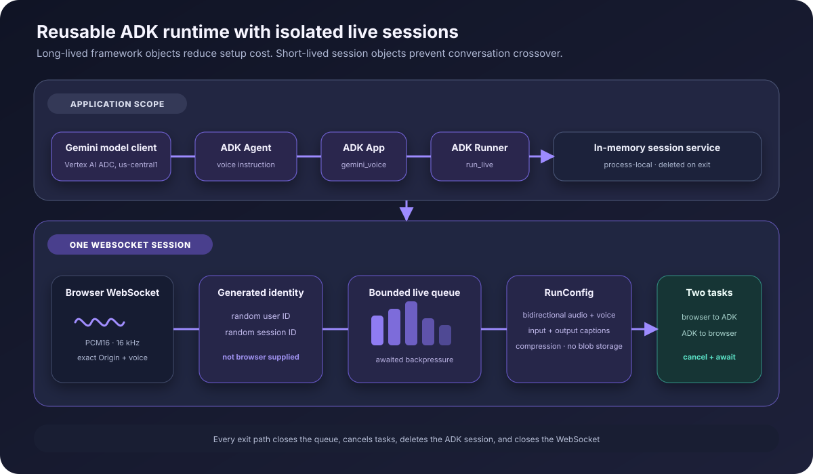
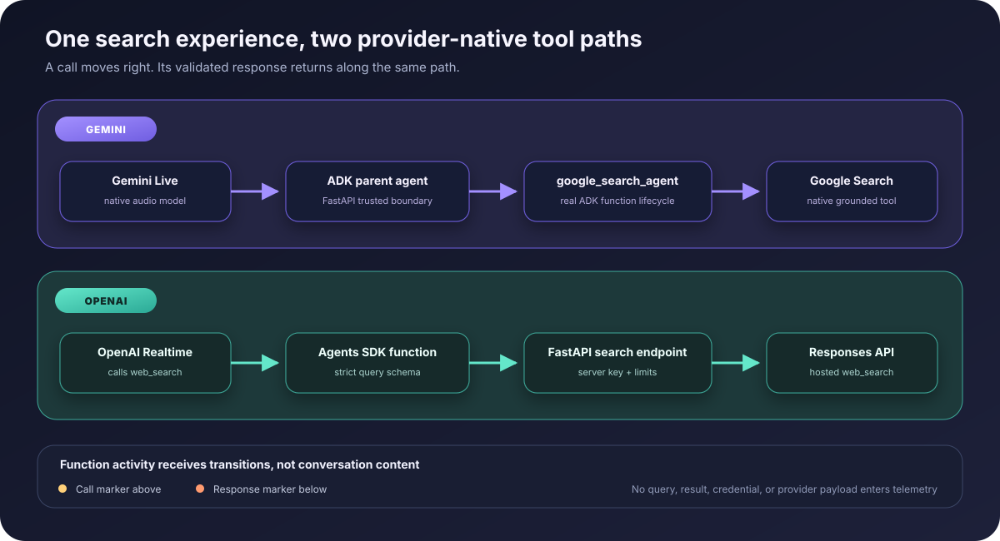
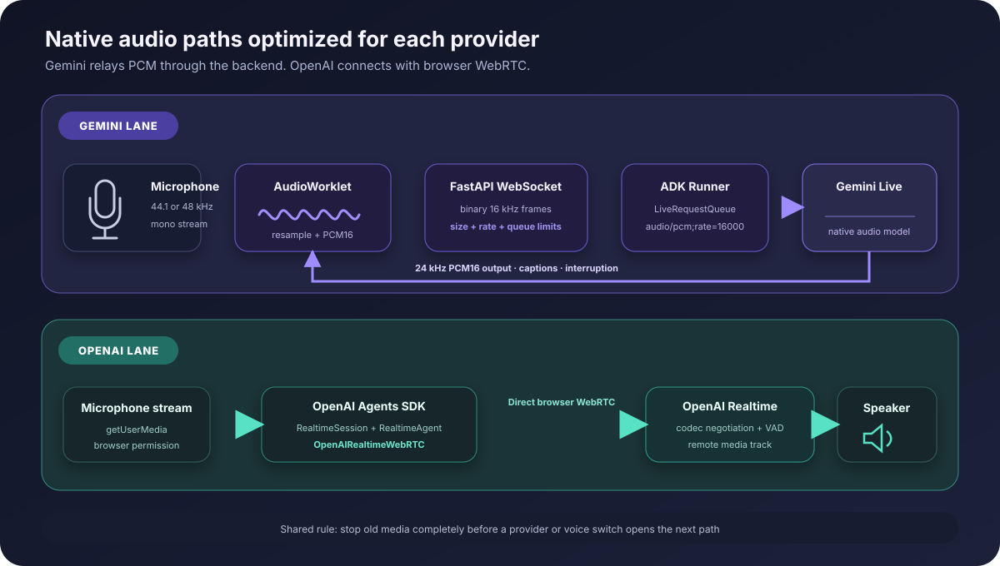
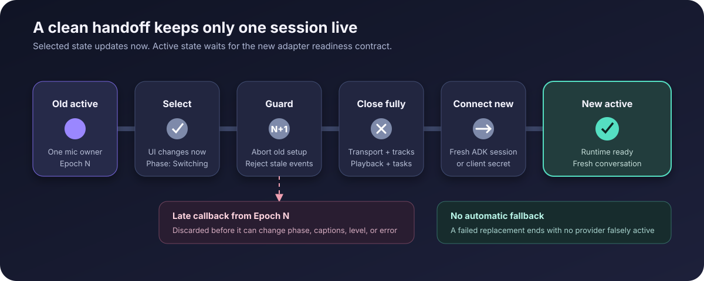
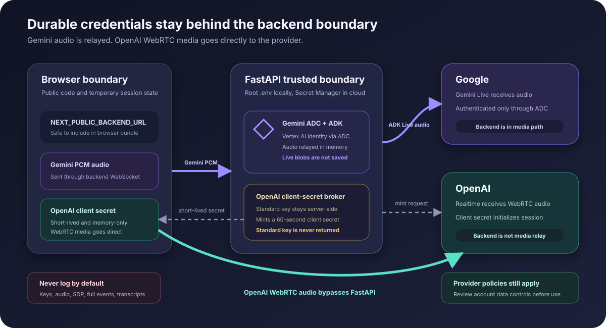

# Architecture

Voice Lab uses one interface and two provider-native agent runtimes. The architecture does not force OpenAI Realtime through Google ADK. Google ADK owns the Gemini lane, while the OpenAI Agents SDK owns the OpenAI lane.



## Design summary

| Concern | Gemini lane | OpenAI lane |
|---|---|---|
| Agent framework | Google ADK 2.6.2, Python | OpenAI Agents SDK 0.14.0, TypeScript |
| Agent object | ADK `Agent` in a reusable `App` | `RealtimeAgent` per browser session |
| Session object | ADK `Runner.run_live` with a fresh session | `RealtimeSession` per browser session |
| Browser transport | Binary WebSocket to FastAPI | `OpenAIRealtimeWebRTC` to OpenAI |
| Backend role | Audio gateway, agent runtime, and search function | Client-secret broker and hosted-search boundary |
| Server model | `gemini-live-2.5-flash-native-audio` | `gpt-realtime-2.1` |
| Search path | ADK `GoogleSearchAgentTool` using `gemini-2.5-flash` | Agents SDK function using Responses API `web_search` with `gpt-5.6` |
| Input audio | PCM16, 16 kHz, little-endian | WebRTC negotiated audio |
| Output audio | PCM16, 24 kHz, little-endian | WebRTC remote media track |
| Conversation persistence | In-memory for one socket, then deleted | Held by the live Realtime session |

This separation follows the provider guidance:

- Google ADK documents `RunConfig` with `Runner.run_live(...)` for live agents in [streaming configuration](https://adk.dev/streaming/configuration/).
- OpenAI recommends the Agents SDK voice APIs and WebRTC for browser speech applications in the [Voice Agents guide](https://developers.openai.com/api/docs/guides/voice-agents) and [Realtime WebRTC guide](https://developers.openai.com/api/docs/guides/realtime-webrtc).

## Gemini ADK runtime



FastAPI creates these application-scoped objects once during startup:

1. `Gemini` model client configured for Vertex AI, the supported `us-central1` sample location, and Application Default Credentials.
2. ADK `Agent` with the voice assistant instruction.
3. ADK `GoogleSearchAgentTool` backed by the native `google_search` tool.
4. ADK `App` named `gemini_voice`.
5. `InMemorySessionService`.
6. ADK `Runner`.

Each accepted Gemini WebSocket gets its own:

1. Cryptographically random browser user ID.
2. Cryptographically random session ID.
3. `BoundedLiveRequestQueue` with async backpressure.
4. `RunConfig` containing bidirectional streaming, audio response modality, selected voice, input and output transcription, context compression, and `save_live_blob=False`.
5. Browser-to-ADK and ADK-to-browser tasks.

Before it sends `ready`, the gateway places a short silence probe in the bounded queue, starts `Runner.run_live(...)`, and waits for ADK to consume that probe. Queue consumption happens only after the upstream live setup is active. A setup timeout or an event-stream exit fails the session instead of showing Active prematurely. Model events remain gated until the browser receives `ready`.

The reusable objects reduce setup work, while the new session and queue prevent one browser conversation from sharing state with another. The session is deleted in `finally`, even after a provider error, protocol violation, timeout, or disconnect.

Session resumption is intentionally disabled. The model documents a default
10-minute conversation boundary, so the application closes at 540 seconds and
keeps one minute of provider headroom. Extending sessions requires a separate,
explicitly tested resumption design.

The current in-memory session service is a deliberate privacy and simplicity choice. ADK documents that it is nonpersistent and best suited to local development or cases that do not need long-term storage in the [session service guide](https://adk.dev/sessions/session/). Production products that need durable history should choose a persistent service only after defining retention, deletion, identity, and authorization requirements.

## Gemini browser protocol

The browser opens:

```text
ws://127.0.0.1:8000/api/live/gemini?voice=Kore
```

For production, the frontend derives `wss://` from an HTTPS backend URL.

### Browser to backend

- Binary WebSocket messages contain ordered signed PCM16 audio at 16 kHz.
- A final text message contains exactly `{"type":"end"}`.
- Empty frames, odd byte lengths, oversized frames, excessive byte rate, unknown JSON, and extra JSON fields are rejected.

### Backend to browser

The first message is a safe acknowledgement:

```json
{
  "type": "ready",
  "provider": "gemini",
  "model": "gemini-live-2.5-flash-native-audio",
  "voice": "Kore",
  "input_sample_rate": 16000,
  "output_sample_rate": 24000,
  "agent_runtime": "google-adk"
}
```

Binary messages contain PCM16 output audio at 24 kHz. Small JSON control messages use these shapes:

```json
{"type":"caption","role":"assistant","text":"Hel","item_id":"gemini-assistant-0","final":false,"mode":"append"}
{"type":"caption","role":"assistant","text":"Hello","item_id":"gemini-assistant-0","final":true,"mode":"replace"}
{"type":"interrupted","item_id":"gemini-assistant-0"}
{"type":"endpoint","kind":"speech-end"}
{"type":"tool_activity","kind":"call"}
{"type":"tool_activity","kind":"return"}
{"type":"turn_complete"}
{"type":"error","message":"Gemini Live could not continue this session."}
```

The gateway never serializes an entire ADK event. It forwards only approved transcription, audio, interruption, completion, VAD transition, anonymous tool transition, and generic error fields. An interruption names the exact assistant item affected, so a late event cannot relabel an earlier completed answer. ADK can flush the finished transcription and interruption in separate responses, so the cursor retains the active assistant item until `turn_complete`. Audio parts on an interrupted event are discarded instead of replaying a cancelled tail after the browser clears its queue. ADK partial transcription is appended. Its finished transcription is cumulative, so the gateway marks it `replace` to avoid duplicate text. Internal identifiers, usage metadata, provider exception text, tool names, arguments, and results stay outside the browser protocol.

## OpenAI Agents SDK runtime

The OpenAI implementation lives in the browser because the TypeScript Agents SDK provides the native abstractions needed for a browser Realtime session:

```text
RealtimeAgent
    + RealtimeSession
    + OpenAIRealtimeWebRTC
    + short-lived client secret
    = browser speech-to-speech session
```

The sequence is:

1. The browser requests microphone permission.
2. It sends `{"provider":"openai","voice":"marin"}` to `POST /api/session-token`.
3. FastAPI validates the exact origin, provider, and allowlisted voice.
4. FastAPI calls OpenAI's `/v1/realtime/client_secrets` with the standard key,
   server-controlled session settings, and a backend-generated anonymous
   `OpenAI-Safety-Identifier`.
5. FastAPI returns the short-lived value, expiry, model, safe browser configuration, and fixed WebRTC transport descriptor.
6. The browser creates `OpenAIRealtimeWebRTC` with its media stream and audio element.
7. It creates a `RealtimeAgent` and `RealtimeSession` with `historyStoreAudio: false` and tracing disabled.
8. `session.connect(...)` completes the Realtime WebRTC setup.
9. Agents SDK history and audio events drive captions, status, completion, and interruption UI.

The [OpenAI Realtime WebRTC documentation](https://developers.openai.com/api/docs/guides/realtime-webrtc) explains the browser WebRTC recommendation, ephemeral credential flow, and safety-identifier header. This unauthenticated sample creates a new opaque identifier for every session. A production service should instead send a stable, privacy-preserving hash of its authenticated user ID, following the [OpenAI safety identifier guidance](https://developers.openai.com/api/docs/guides/safety-best-practices#implement-safety-identifiers).

The short-lived client secret is not treated as a complete security policy. Client-side session configuration can change within provider rules, so production authorization must not assume the browser is incapable of requesting other allowed Realtime behavior.

## Provider-native web search



The two voice runtimes expose the same user capability through different supported mechanisms:

### Gemini

The parent Live agent exposes one ADK function named `google_search_agent`. When Gemini calls it, ADK runs a dedicated text sub-agent using `gemini-2.5-flash` and the native `google_search` tool. The function response returns to the parent Live turn, which speaks the grounded result. The search sub-agent uses the same Vertex AI ADC project and location as the Live model. Google documents Google Search as a Live API tool in its [ADK Live tutorial](https://docs.cloud.google.com/gemini-enterprise-agent-platform/models/live-api/get-started-adk) and lists Search as a Tool and function calling in the [Live API reference](https://docs.cloud.google.com/gemini-enterprise-agent-platform/reference/models/multimodal-live).

Wrapping search as an ADK agent function is deliberate. A direct built-in search can surface grounding metadata without producing the parent function-call lifecycle required by the UI. The wrapper gives the parent Live session a real function call and function response while retaining native Google grounding inside the search agent.

### OpenAI

OpenAI Realtime supports function tools executed by the application. It does not directly expose the Responses API hosted `web_search` tool as a Realtime session tool. The browser therefore registers a strict `web_search({query})` function on `RealtimeAgent`. Its executor posts the bounded query to `POST /api/tools/web-search`. FastAPI uses the permanent server key to call the Responses API with hosted `web_search`, forces a search for that function invocation, validates and bounds the answer and source URLs, then returns the result to the Agents SDK. See the official [Realtime tools guide](https://developers.openai.com/api/docs/guides/realtime-mcp) and [web search guide](https://developers.openai.com/api/docs/guides/tools-web-search).

The search endpoint has an exact-origin check, strict input schema, independent rate and concurrency controls, no-store responses, a provider timeout, and generic public errors. Search content is treated as untrusted data. A public production deployment still needs user authentication and distributed quotas.

### Function activity projection

Both paths produce a call followed by a response. Gemini projects sanitized ADK function events through its WebSocket. OpenAI projects sanitized Agents SDK function history. The browser records only transition type and sequence, never tool IDs, queries, result text, or provider payloads. The UI shows **Calling** and **Response** plus the two timeline markers. The spoken and captioned assistant answer remains the user-facing result.

## Audio and control flow



Gemini requires an application-managed audio pipeline. The AudioWorklet downsamples the microphone to 16 kHz PCM16. FastAPI sends an ADK `Blob` with MIME type `audio/pcm;rate=16000`. Output PCM is scheduled at 24 kHz. Interruption clears queued playback.

OpenAI delegates codec negotiation, capture transport, jitter handling, and remote audio playback to WebRTC and the Agents SDK transport. Its data and session events drive application state without passing OpenAI media through FastAPI.

Do not decode OpenAI WebRTC media with the Gemini PCM player. Do not send Gemini PCM frames to the OpenAI session.

## Immediate provider switching

The session hook keeps selected state separate from acknowledged active state. Every start or switch increments a generation number, represented as an epoch.



The ordered transition is:

1. Record the newly selected provider.
2. Increment the epoch and abort setup from the previous epoch.
3. Mark partial captions from the old epoch as interrupted.
4. Fully await the old adapter's idempotent cleanup.
5. Create the new provider adapter.
6. Connect using a fresh ADK session or fresh OpenAI client secret.
7. Accept callbacks only when their epoch is still current.
8. Publish Active only after the new adapter completes its readiness contract.
9. Add a transcript divider naming the provider and model.

There is no context transfer and no automatic fallback. This prevents an old callback from overwriting current UI and prevents two adapters from owning the microphone at once.

## Secret and privacy boundaries



The root `.env` is the only local environment file read by FastAPI. It selects Vertex AI and contains the OpenAI key. Local Google ADC remains in the Google Cloud CLI credential store outside the repository. On Cloud Run, ADC comes from the attached service identity. `SecretStr` prevents casual representation of the OpenAI key. `app/.env.local` contains only `NEXT_PUBLIC_BACKEND_URL`, which is public by design.

| Data | Browser | FastAPI | Google | OpenAI |
|---|---:|---:|---:|---:|
| Google ADC | No | Resolved by backend | Used for Vertex AI auth | No |
| OpenAI permanent key | No | Yes | No | Used for client-secret and hosted-search requests |
| OpenAI client secret | Briefly | Briefly | No | Used for WebRTC setup |
| Gemini raw audio | Yes | Relayed in memory | Yes | No |
| OpenAI raw audio | Yes | No media relay | No | Yes |
| Cross-provider history | No | No | No | No |

Responses from `/api/*` are marked `no-store`. The application avoids logging raw audio, credentials, authorization headers, SDP, full ADK events, and upstream bodies.

## Backend request controls

The backend applies:

- exact origin allowlisting with no wildcard;
- missing-origin rejection in production;
- strict Pydantic request models with unknown fields forbidden;
- provider-specific voice allowlists;
- server-controlled model names and provider URLs;
- process-local sliding-window rate limits;
- process-local concurrency guards;
- bounded Gemini frame size, byte rate, burst allowance, queue depth, and session duration;
- generic public upstream errors;
- disabled OpenAPI and interactive documentation routes.

Process-local limits are useful defense in depth, not a public identity or global quota system. A production edge should authenticate users and apply distributed principal-based quotas.

## Repository map

```text
gemini-voice/
├── .env.example                 backend-only configuration template
├── app/                         Next.js browser application
│   ├── public/                  AudioWorklet processor
│   ├── src/components/          accessible voice UI
│   ├── src/lib/                 adapters, protocols, audio, session state
│   └── tests/                   frontend unit tests
├── backend/
│   ├── app/adk_runtime.py       reusable Google ADK Agent, App, Runner
│   ├── app/gemini_live.py       bounded WebSocket and ADK bridge
│   ├── app/providers.py         OpenAI client-secret and hosted-search calls
│   ├── app/main.py              routes, origin policy, limits, lifespan
│   ├── app/config.py            deterministic root .env settings
│   └── tests/                   backend unit and protocol tests
└── docs/                        tutorial and vector diagrams
```

## Model authority

The backend is authoritative for all model names. The Gemini voice runtime uses `gemini-live-2.5-flash-native-audio`, and its Google Search function uses `gemini-2.5-flash`. The OpenAI voice runtime uses `gpt-realtime-2.1`, and its hosted search request uses `gpt-5.6`. Vertex AI is fixed with `GOOGLE_GENAI_USE_VERTEXAI=true`, an explicit `GOOGLE_CLOUD_PROJECT`, and `GOOGLE_CLOUD_LOCATION=us-central1`. The sample location must remain supported by both selected Gemini models. The settings UI reads `/health`, and a live adapter reports the effective voice model when its session path is ready. The app then changes Selected model to Active model. Gemini Active means the ADK gateway session and event stream are ready, not that Vertex AI has already processed an audio frame.

Changing a model requires a backend environment update, compatibility testing, and a new deployment. The browser is not allowed to submit an arbitrary model string.

The Gemini Developer API and Vertex AI do not share a guaranteed model catalog.
`gemini-3.1-flash-live-preview` is currently documented on `ai.google.dev`, but
the organization-required ADC and Vertex path in this repository uses the
current Vertex-listed GA `gemini-live-2.5-flash-native-audio`. A Developer API
model string must not be copied into this configuration unless the current
Cloud model card explicitly lists it for Vertex AI.

## Extension points

The ADK `Agent` is ready for carefully reviewed tools, callbacks, evaluation, and a persistent session service. Add tools only after defining authorization and confirmation behavior. A voice instruction is not authorization for a real-world action.

The OpenAI `RealtimeAgent` can add Agents SDK tools, guardrails, and handoffs. Keep sensitive tool execution on a trusted backend. Do not put privileged tool credentials or unrestricted side effects in browser code.

For deployment decisions, continue to [deployment](deployment.md).
