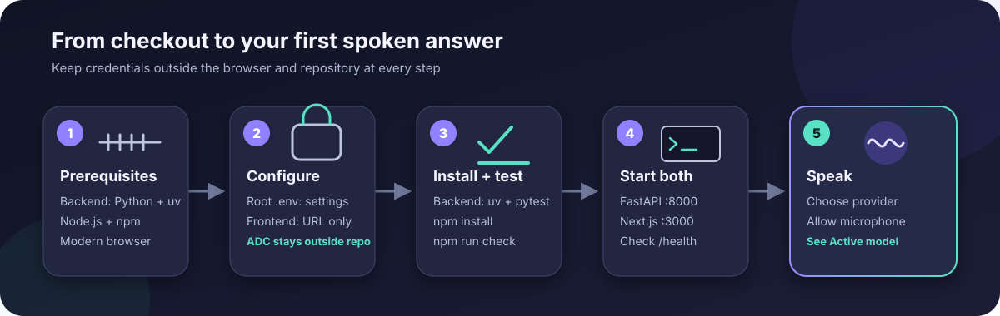

# Installation and local setup

This guide takes you from a clean checkout to a working speech-to-speech conversation. Gemini always uses Vertex AI with Application Default Credentials. OpenAI uses a server-side project key to create short-lived browser credentials.



## 1. Check the prerequisites

Install these tools before continuing:

| Tool | Supported version | Check command |
|---|---|---|
| Python (backend only) | 3.11 through 3.14 | `python3 --version` |
| uv (backend only) | Current stable | `uv --version` |
| Node.js | 22.13 or newer | `node --version` |
| npm | Bundled with Node.js | `npm --version` |
| Google Cloud CLI | Current stable | `gcloud version` |

You also need:

- a Google Cloud project with billing enabled;
- permission to use Vertex AI and consume project quota;
- an OpenAI project API key;
- a modern browser with microphone, AudioWorklet, and WebRTC support.

## 2. Prepare the Google Cloud project

Set the CLI project and enable Vertex AI:

```bash
gcloud config set project YOUR_PROJECT_ID
gcloud services enable aiplatform.googleapis.com \
  --project=YOUR_PROJECT_ID
```

Your local principal needs permission to invoke Vertex AI. It also needs `serviceusage.services.use` on the quota project. Ask an administrator for the narrowest suitable roles if either permission is missing. Common predefined roles are Vertex AI User and Service Usage Consumer.

The selected model is `gemini-live-2.5-flash-native-audio`. This tutorial uses
the supported `us-central1` Vertex AI location. The model does not accept the
`global` endpoint. Confirm region availability in the official
[Gemini 2.5 Flash Live API model card](https://docs.cloud.google.com/gemini-enterprise-agent-platform/models/gemini/2-5-flash-live-api)
before selecting another location. Google announced this native-audio model as
generally available in the
[Vertex AI release notes](https://docs.cloud.google.com/vertex-ai/generative-ai/docs/release-notes).

The current model card lists December 13, 2026 as the retirement date. Treat the
model setting as a deployment watch item. Before each release, confirm the date,
supported regions, and migration guidance, then retest the ADK configuration and
audio protocol before changing the model.

Do not copy model strings across Google API surfaces. The
[Gemini Developer API](https://ai.google.dev/gemini-api/docs/models/gemini-3.1-flash-live-preview)
currently documents `gemini-3.1-flash-live-preview`, but this application is
required to use Vertex AI with ADC. Its current
[Vertex model card](https://docs.cloud.google.com/gemini-enterprise-agent-platform/models/gemini/2-5-flash-live-api)
lists the GA `gemini-live-2.5-flash-native-audio`. Change this Vertex setting
only when the current Cloud model card lists the target model and the complete
ADK live suite passes.

## 3. Create local Application Default Credentials

Google Cloud CLI login and ADC login are separate. The backend uses ADC, so this command is mandatory:

```bash
gcloud auth application-default login
```

Set the project that local client libraries use for quota and billing:

```bash
gcloud auth application-default set-quota-project YOUR_PROJECT_ID
```

The command requires `serviceusage.services.use` on that project. Verify that ADC can produce an access token without printing it:

```bash
gcloud auth application-default print-access-token > /dev/null
```

The exit status should be zero. Later in this guide, a Python check verifies the quota project recorded on the credential object.

The ADC file created by `gcloud` belongs in the Google Cloud CLI credential store outside the repository. Do not copy it into this project, a Docker build context, `.env`, `app/.env.local`, or a container image. Do not set `GOOGLE_APPLICATION_CREDENTIALS` to the local ADC file. The standard ADC lookup finds it automatically.

Official references:

- [Set up Application Default Credentials](https://docs.cloud.google.com/docs/authentication/provide-credentials-adc)
- [Set an ADC quota project](https://docs.cloud.google.com/sdk/gcloud/reference/auth/application-default/set-quota-project)
- [Troubleshoot ADC](https://docs.cloud.google.com/docs/authentication/troubleshoot-adc)

## 4. Create the OpenAI key

1. Open the [OpenAI API key page](https://platform.openai.com/api-keys).
2. Create a project key with the narrowest suitable project permissions.
3. Keep it ready for the root `.env` file.

FastAPI uses the standard key to request a short-lived Realtime client secret and to execute the protected hosted web-search function. The browser then connects with the [OpenAI Agents SDK voice APIs](https://developers.openai.com/api/docs/guides/voice-agents). The key's project must allow both Realtime and Responses API web search.

## 5. Create the environment files

Run these commands from the repository root:

```bash
cp .env.example .env
cp app/.env.local.example app/.env.local
```

Open `.env` and replace the project and OpenAI placeholders:

```dotenv
GOOGLE_GENAI_USE_VERTEXAI=true
GOOGLE_CLOUD_PROJECT=YOUR_PROJECT_ID
GOOGLE_CLOUD_LOCATION=us-central1
GEMINI_LIVE_MODEL=gemini-live-2.5-flash-native-audio
GEMINI_SEARCH_MODEL=gemini-2.5-flash

OPENAI_API_KEY=replace_with_your_openai_key
OPENAI_REALTIME_MODEL=gpt-realtime-2.1
OPENAI_SEARCH_MODEL=gpt-5.6

WEB_SEARCH_RATE_LIMIT=30
WEB_SEARCH_CONCURRENCY=8

ALLOWED_ORIGINS=http://localhost:3000
APP_ENV=development
```

`YOUR_PROJECT_ID` is an instruction, not a usable value. Replace it with the
exact project that has Vertex AI enabled and that you are authorized to bill.
Do not guess from a long account project list. Confirm the chosen project with
your Google Cloud administrator when necessary. Restart FastAPI after every
`.env` change because settings and the ADK runtime are created at process start.

The frontend file contains only a public URL:

```dotenv
NEXT_PUBLIC_BACKEND_URL=http://127.0.0.1:8000
```

This is an intentional split:

- The root `.env` selects Vertex AI and contains the OpenAI server key.
- Google authentication comes from ADC outside the repository.
- `app/.env.local` contains only public browser configuration.
- `NEXT_PUBLIC_` values are compiled into browser JavaScript during `next build`.
- The real environment files are excluded by `.gitignore`.

Never copy Google credentials, ADC JSON, or the OpenAI key into the frontend file.

## 6. Install, verify, and test the backend

From the backend directory:

```bash
cd backend
uv sync --extra dev
```

Verify the quota project stored on ADC without printing a token:

```bash
uv run python -c \
  'import google.auth; c,_=google.auth.default(); print(getattr(c, "quota_project_id", None))'
```

The output should be `YOUR_PROJECT_ID`. If it is blank or names another project, rerun:

```bash
gcloud auth application-default set-quota-project YOUR_PROJECT_ID
```

Run the backend suite:

```bash
uv run pytest
```

The backend lock resolves Google ADK to 2.6.2. The backend builds one reusable ADK `Agent`, `App`, `Runner`, and in-memory session service. Each browser connection still gets a new session and a new bounded `LiveRequestQueue`.

Start FastAPI:

```bash
uv run uvicorn app.main:app --reload --host 127.0.0.1 --port 8000
```

In another terminal, check safe health metadata:

```bash
curl --fail --silent http://127.0.0.1:8000/health
```

The response should resemble:

```json
{
  "status": "ok",
  "providers": {
    "gemini": {
      "configured": true,
      "model": "gemini-live-2.5-flash-native-audio",
      "runtime": "google-adk"
    },
    "openai": {
      "configured": true,
      "model": "gpt-realtime-2.1",
      "runtime": "openai-agents-sdk"
    }
  }
}
```

`configured` verifies required settings, not live IAM, quota, network, or provider availability.

## 7. Install and start the frontend

In a second terminal:

```bash
cd app
npm install
npm run dev
```

Open [http://localhost:3000](http://localhost:3000). Use the same hostname that appears in `ALLOWED_ORIGINS`. `localhost` and `127.0.0.1` are different browser origins.

## 8. Have the first conversation

1. Open Settings.
2. Choose Gemini Live or OpenAI Realtime.
3. Choose a provider-specific voice.
4. Press the center orb.
5. Allow microphone access when the browser asks.
6. Wait for the badge to say Active model.
7. Speak naturally.
8. Press the orb again to stop.

Headphones reduce acoustic feedback and produce more reliable interruption behavior.

## 9. Run the complete local checks

Backend:

```bash
cd backend
uv run pytest
```

Frontend:

```bash
cd app
npm run check
```

The frontend check runs ESLint, TypeScript, Vitest, and the production Next.js build.

## Local security checklist

- Run `git status --short` before committing and confirm `.env`, `app/.env.local`, and credential JSON files are absent.
- Never copy the local ADC file into the repository or a container.
- Never paste a short-lived OpenAI client secret into logs or screenshots.
- Never record a browser Network panel while credentials are visible.
- Keep `ALLOWED_ORIGINS` exact. Wildcards are rejected.
- Use `APP_ENV=production` outside local development so missing `Origin` headers are rejected.
- Rotate the OpenAI key immediately if it appears in a commit, terminal recording, issue, or chat.

Next: read the [user guide](user-guide.md) or explore the [architecture](architecture.md).
